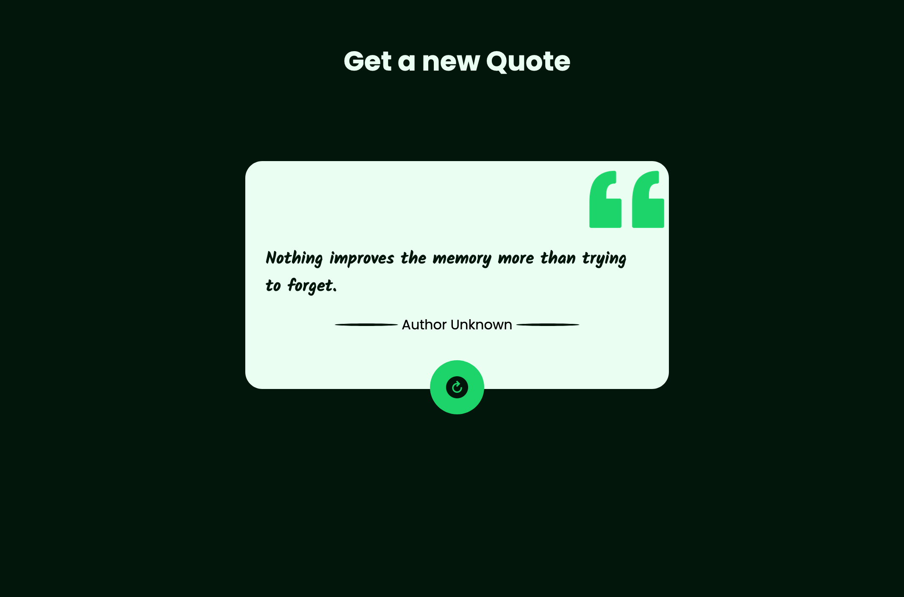

# Random Quote Generator

This is a simple component to get random quotations from [Quote.net](https://www.quotes.net/) API.

It uses JavaScrip **_Async_** and **_Await_** functions to get the quotes loaded in page on time. Super happy with the result. :)

Also, it worth to mentioned that I got a very good explanation from some [Bro Code](https://www.youtube.com/@BroCodez) videos on how to use these Js functions.

[Click here](https://gregorim04.github.io/Random-Quote-Generator/) to see the Live page.